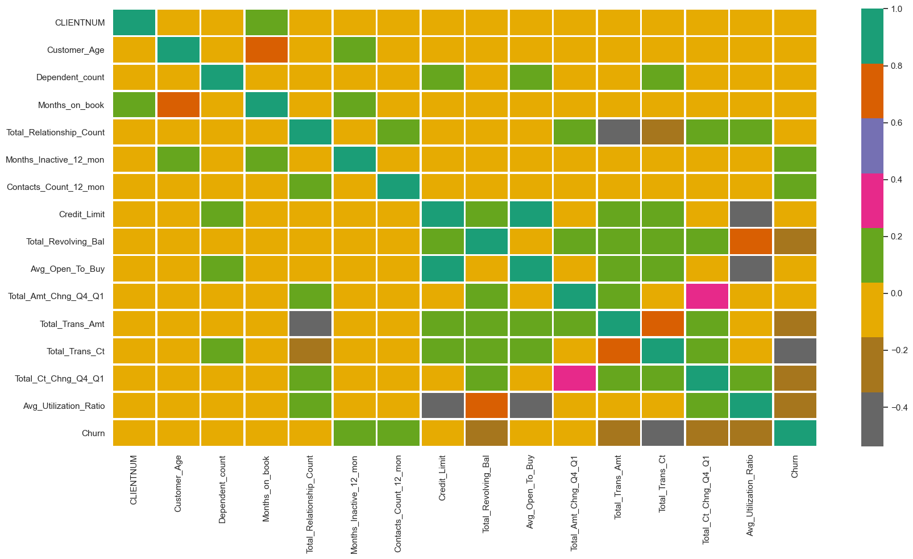
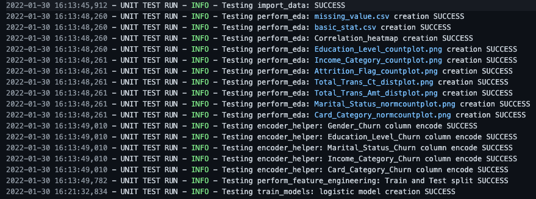
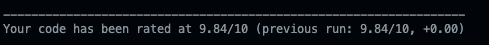
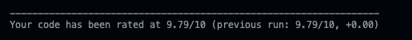

# Predict Customer Churn with Production Ready Code

## Project Description 👷🏻‍♂️💸🧑🏻‍💻
Main purpose of this project is to create machine learning model script that can **predict credit card customers that are most likely to churn** with PEP8 and **software engineering best pratices** for implementing machine learning in production (modular, documented and tested)

All exploratory data analysis and model development have been experimented  in **Jupyter Notebook** and convert into *.py* format for modularlization and testing purpose.


## Data
This project use data from [kaggle](https://www.kaggle.com/sakshigoyal7/credit-card-customers) which contains data about customer infomations total 21 columns and 10,000 rows. 2 Group of data are Demographic data of customer and Bank related data.

**Target Columns:**
- Attrition_Flag : Exiting Customer/ Attrited Customer

**Demographic Data:**
- **Gender** : M (Male), Female
- **Educaton_Level** : ex. Graduate, High School
- **Income_Category** : ex. Less than <$40K, $40K - $60K
- **Marital_Status** : ex. Married, Single
- **Dependend_count** : 0 - 5
- **Customer_Age** : 26 - 73 years

**Bank Related Data :**
- **Card_Category** : Product variables ex. Blue, Silver
- **Months_on_book** : Period of relationship with bank (13 - 56 months)
- **Total_Relationship_Count** : Total no. of products held by the customer
- **Months_Inactive_12_mon** : No. of months inactive in the last 12 months
- **Contacts_Count_12_mon** : No. of Contacts in the last 12 months
- **Credit_Limit** : Credit Limit on the Credit Card
- **Total_Revolving_Bal** : Total Revolving Balance on the Credit Card
- **Avg_Open_To_Buy** : Open to Buy Credit Line (Average of last 12 months)
- **Total_Amt_Chng_Q4_Q1** : Change in Transaction Amount (Q4 over Q1)
- **Total_Trans_Amt** : Total Transaction Amount (Last 12 months)
- **Total_Trans_Ct** : Total Transaction Count (Last 12 months)
- **Total_Ct_Chng_Q4_Q1** : Change in Transaction Count (Q4 over Q1)
- **Avg_Utilization_Ratio** : Average Card Utilization Ratio

## Project Structure
    └── Predict Customer Churn with Clean Code 
        ├── data             # Folder to store data
        |   └── data profile # Folder to store profile of data
        ├── images           # Collect all images results
        |   ├── eda            
        |   └── results       
        ├── logs                   # Collect all logs from running
        ├── models                 # Path to store trained ml models
        ├── churn_notebook.ipynb   # Notebook for experiment
        ├── churn_library.py                   # Main script for running
        ├── churn_script_logging_and_tests.py  # Test and logging script
        ├── settings.py                        # Collect constant values
        ├── requirement.txt                    # List of require library versions
        └── README.md                          # This file

## Running Files
### Running Script
Main file to run is ```churn_library.py```. This will contains all functions for EDA, model training and save all results from EDA and trained model into target directory.<br/>
Thse package can interactively run from common-line interface (CLI) by follow script

``` CLI
python churn_library.py
```
All result from running script will be stored in target folders as below
- ```model``` : Store trained model file in .pkl format
- ```data/data profile``` : Store missing value and basic statistic properties of dataset
- ```images/eda``` : Store all graph from EDA process by given type of plot  columns
- ```images/results``` : Store Classification Report/ Feature Importance and ROC Curve
- ```logs``` : Log file for running is named as **test_results.logs**

Example of **correlation heat map** plotting from ```./images/eda``` folder are as below.


Model performance on test data on ROC curve in ```./images/results``` are as below.


### Unit Test Script
To perform unit testing all functions, you can use ```churn_script_logging_and_tests.py```
You can rub it from CLI by follow script
``` CLI
python churn_script_logging_and_tests.py
```
All test result in this test script will be store in ```logs``` as **test_results.logs** <br/>
Example of all success test logs are as below pictures.



## Process in **Running Script**
In ```churn_library.py```, there are composed with these main functions
1. ```import_data```  <br/>
2. ```perform_eda```  <br/>
3. ```encoder_helper```  <br/>
4. ```perform_feature_engineering```  <br/>
5. ```train_models```  <br/>

## Process in **Testing Script**
In ```churn_script_logging_and_tests.py```, there are 5 test functions as below
1. ```test_import``` :
2. ```test_eda``` :
3. ```test_encoder_helper``` :
4. ```test_perform_feature_engineering```:
5. ```test_train_models```:

## Code Format Scoring
According to score criteria from [pylint](https://pylint.org/) with the running script (```churn_library.py```) and testing script (```churn_script_logging_and_tests.py```) below pictures is results 

**churn_library.py** = 9.84/10 <br/>


**churn_script_logging_and_tests.py** = 9.79/10 <br/>
