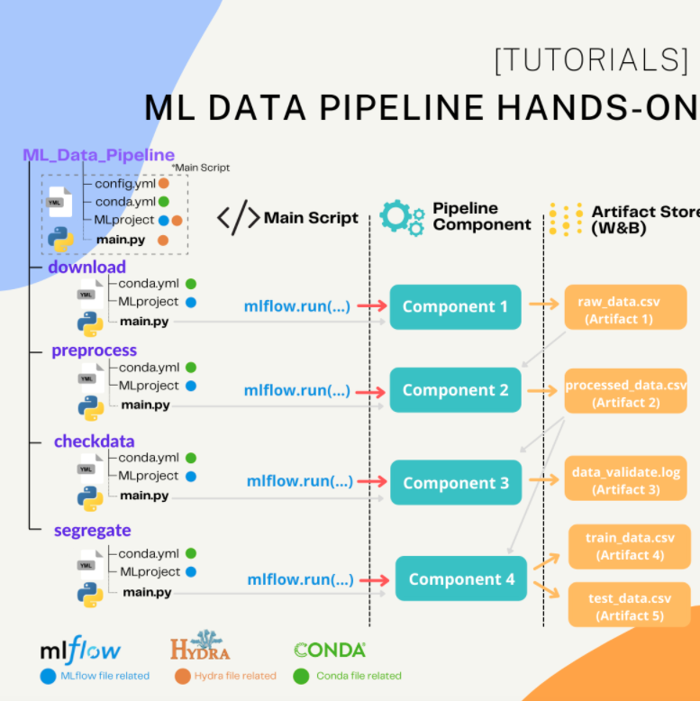

# (Hands-On) Machine Learning Data Pipeline

## Overview
 <br/>
This project will bring you go throuhgt on first element of Machine Learning in MLOps which is ```Data Pipeline``` <br/>
In every machine learning project, data pipeline is mandatory to make our incoming data ready to use(train-test split), validate data profile and finding some insight from new data. <br/>
Step-by-Step simple re-usable data pipeline creation with MLflow and Weight and Bias plarform will be introduced here.


## Contents
- [Environment Setup](#set-up)
- [Data](#data)
- [Action in Pipeline](#action_in_pipeline)
- [File Structure](#file-structure)
- [Main Script](#main_script)
  * [Conda File](#hydra-config-file)
  * [MLproject File](#ml-project-file)
  * [Hydra Config File](#hydra-config-file)
  * [main.py](#main.py)
- [Download Component](#download_component)
  * [MLproject File](#ml-project-file)
  * [main.py](#main.py)
  
## Environment Setup
Before your start to follow along this tutorial, what you have to install are  **Conda**, **MLFlow** and **Hydra** and **WeightAndBias**

**[Conda](https://docs.conda.io/en/latest/)** <br/>
Conda is python environment management library.
In every pieces of machine learning pipelie (ex. dowload_data, preprocessing) We will use Conda to encapsulate all requirement for running the script on each pipline.
```bash
> pip install conda
```
Then create conda environment with ```enviroment.yml```

``` bash
> conda env create -f environment.yml
> conda activate wandb_datapipeline
```

**[MLflow](https://mlflow.org/)** <br/>
MLflow provide you a bunch of lightweight APIs for machine learning life cycle development such as experiment tracking, packing code as reproducible pipeline and deployment.<br/>
In this tutorials we will use [MLflow Projects](https://www.mlflow.org/docs/latest/projects.html) to pack our python script into resuable date pipeline.

**[Hydra](https://github.com/facebookresearch/hydra)** <br/>
Hydra is frame for hierarchical configuration creation. This library enable you to store complex config variables and override it via config file and command line.

We will store all configurable variables in ```config.yml``` and use all variable via arguments parser when MLflow call the pipeline.

**[Weight and Bias](https://wandb.ai/home)** <br/>
Weight and Bias is machine learning platform that come with many features including **tracking**, **versioning data and model**, **data visualization**, **reporting** and **hyperparameters sweeper**. <br/>
 <br/>
After you install weight and bias on your conda environment from previous step and completed account creation on [website.](https://wandb.ai) <br/>
To get API key for authentication on communication from your local machine to weight and bias service, please use this link [https://wandb.ai/authorize](https://wandb.ai/authorize) and use below command in CLI
``` %python
wand longin [API key]
```

On this tutorial, we will use weight and bias to store processed data and track all the script run.

## Data 🎤🎹
In this tutorials we use songs dataset from [Kaggle](https://www.kaggle.com/mrmorj/dataset-of-songs-in-spotify). Data set is collected by Spotify API.<br/>


This data contains sound chraracteristics (ex. danceability, loundness, valence) from on song with its genre. All of them are numerical value.

End goal is to classify song genre with sound characteristics data. (Multi-Class Classification) <br/>

## Action in Pipeline 

**dowload**
> Input : File URL location (In this case my github folder) <br/>
>
> Action :
> - 1.) Download raw data from target location<br/>
> - 2.) Upload raw data as artifact into Weight and Bias <br/>
>
> Output : raw_data.csv (artifact in WandB)

**preprocess**
> Input : raw_data.csv (artifact from WandB)
>
> Action :
> - 1.) Drop duplications in data <br/>
> - 2.) Perform simple feature engineering <br/>
> - 3.) Upload processed data to Weight and Bias <br/>
>
> Output : preprocessed_data.csv (artifact in WandB)

**checkdata**
> Input : 
> - preprocessed_data.csv (artifact from WandB)
> - reference_data (In this case, another half of data)
>
> Action :
> - 1.) Use PyTest perform test via PyTest fixture<br/>
> - 2.) Test columns presence and data type<br/>
> - 3.) Test genre class presence <br/>
> - 4.) Perform KS-Test to detect dift <br/>
> - 5.) Sent all test log to Weight and Bias <br/>
>
> Output : pytest_testing.logs (artifact in WandB)

**segregate**
> Input : preprocessed_data.csv (artifact from WandB)
>
> Action :
> - 1.) Download data from Weight and Bias <br/>
> - 2.) Split data for train and test from given test_size, and stratify column <br/>
> - 3.) Upload train/ test data as artifact into Weight and Bias <br/>
>
> Output :
> - train_data.csv
> - test_data.csv 

## File Structure 🗂
    └── ML_Data_Pipeline
        ├── config.yaml      # Hydra config file
        ├── conda.yml             
        ├── main.py
        ├── MLProject
        |
        ├── download        # Download component
        |   ├── conda.yml            
        |   ├── MLproject
        |   └── main.py
        ├── preprocess      # Preprocess component
        |   ├── conda.yml            
        |   ├── MLproject
        |   └── main.py
        ├── checkdata       # Checkdata component
        |   ├── conda.yml            
        |   ├── MLproject
        |   └── main.py
        └── segregate       # Segregate component
            ├── conda.yml            
            ├── MLproject
            └── main.py

After this section, details explanation on how each file is being used and imortance of its will be done only in ```main``` script and ```download``` step for the shorten reading and writting time.

## Main Script
According to file structure have shown, in every running components even on main script (outermost main.py) we need 2 YAML files together ```MLproject``` and ```conda.yml``` with python script (```main.py```) that contains all action we want for each pipeline component. <br/>

### **Conda File**
This YAML file will use tell the MLflow known what is our required library to make ```main.py``` script runnable. <br/>
2 main importance sections here are
- ```channels```: location where conda will go to look for ```dependencies``` declared variables.
- ```dependencies```: All dependencies library require to make main.py runnable 

Note that some of might not available in declared channel like [conda-forge](https://anaconda.org/conda-forge) and [defaults](https://repo.anaconda.com/pkgs/), in this case ```pip``` is required in depedencies and you must declare all pip install library under it.
 
Example of ```conda.yml``` with required libary from pip install
``` YAML
name: initial_mlflow_run
channels:
  - conda-forge
  - defaults
dependencies:
  - python=3.8
  - requests=2.24.0
  - pip=20.3.3
  - mlflow=1.14.1
  - hydra-core=1.0.6
  - pip:
      - wandb==0.10.21
      - hydra-joblib-launcher==1.1.2
```
### **MLproject File**
This file use to organize how to run our script in humand readable way.<br/>
2 mains importance sections here are
- **Project Environment** : To tell mlflow where is our environment for this component. In our tutorials we use argurment```conda_env``` refer to ```conda.yml``` we created.
- **entry_points** : ```command``` that can be run within the project, and information about their ```parameters```.

Example of MLproject file
``` YAML
name: initial_mlflow_run
conda_env: conda.yml

entry_points:
  main:
    parameters:
      hydra_options:
        description: Hydra parameters to override
        type: str
        default: ''
    command: >-
      python main.py $(echo {hydra_options})
```
From abobe code snippet, in ```parameters``` section we declare ```hydra_options``` as input variable in ```main.py script``` <br/>
And in **command**, it is how mlflow will make execute on script (in our case  we use python main.py) with all input variables related to this run.

### **Hydra Config File**
For ```config.yml```, this file will be use for hydra library to store and overwrite variables during script running. <br/>
Below is our config.yml in this tutorials be store all 
``` YAML
main:
  project_name: ml_data_pipeline
  experiment_name: dev
  execute_steps:
    - download
    - preprocess
    - check_data
    - segregate
  random_seed: 112233
data:
  file_url: "https://github.com/wasuratme96/Machine-Learning-DevOps-Engineering/blob/main/......"
  reference_dataset: "ml_data_pipeline/preprocessed_data.csv:latest"
  ks_alpha: 0.05
  test_size: 0.3
  val_size: 0.3
  stratify: genre
```
All variables being used in this project will be stored here.  We can overwrite all of these variable via below example  script. <br/>
- Run only ```preprocess``` with ```test_size``` = 0.2 (default is 0.3)<br/>
- Change the ```exeriment_name``` into "pre-prod"
``` CLI
mlflow run . -P execute_steps=preprocess \
             -P hydra_options="data.test_size=0.2"\
             -P hydra_options="main.experiment_name=pre-prod"
```

### **main.py**
This is the main script where we write all the pipeline interaction and their input-output arguments. <br/>

First, let start on how can we use hydra config.yml as input into out script.
By using ```@hydra.main``` wrapper from hydra and declare the naming for using (in ourcase we use "config") and input this variable into our functions as a DictConfig
``` python
# This automatically reads in the configuration
# from config.yml 
@hydra.main(config_name='config')
def go(config: DictConfig):

    # Setup the wandb experiment. All runs will be grouped under this name
    os.environ["WANDB_PROJECT"] = config["main"]["project_name"]
    os.environ["WANDB_RUN_GROUP"] = config["main"]["experiment_name"]

    # You can get the path at the root of the MLflow project with this:
    root_path = hydra.utils.get_original_cwd()

    # Check which steps we need to execute
    if isinstance(config["main"]["execute_steps"], str):
        # This was passed on the command line as a comma-separated list of steps
        steps_to_execute = config["main"]["execute_steps"].split(",")
    else:
        steps_to_execute = list(config["main"]["execute_steps"])
```
Then we can access all stored variable in ```config.yml``` with config variable. <br/>
Example ```config["main"]["project_name"]``` will calling the default value "ml_data_pipeline" <br/>
or ```config["main"]["execute_steps"]``` will get all naming of steps in running **(download, preprocess, check_data, segregate)**

Next is how each step in pipeline is workng together. <br/>
You could see that to pass variables from hydra config file, this can do by using ```config["data"][xxx]```  and all parameters require as input will be insert in ```parameters``` arguments.

``` python
if "download" in steps_to_execute:
        _ = mlflow.run(
            os.path.join(root_path, "download"),
            "main",
            parameters={
                "file_url": config["data"]["file_url"],
                "artifact_name": "raw_data.parquet",
                "artifact_type": "raw_data",
                "artifact_description": "Data as downloaded"
            },
        )
# Preprocess step
if "preprocess" in steps_to_execute:
    _ = mlflow.run(
        os.path.join(root_path, "preprocess"),
        "main",
        parameters = {
            "input_artifact": "raw_data.parquet:latest",
            "artifact_name" : "preprocessed_data.csv",
            "artifact_type" : "preprocessed_data",
            "artifact_description" : "Data with preprocessing applied"
        }
# Check data step
if "check_data" in steps_to_execute:
    _ = mlflow.run(
        os.path.join(root_path, "check_data"),
        "main",
        parameters = {
            "reference_artifact" : config["data"]["reference_dataset"],
            "sample_artifact" : "preprocessed_data.csv:latest",
            "ks_alpha" : config["data"]["ks_alpha"]
        }
    )
# Segregate step
if "segregate" in steps_to_execute:
    _ = mlflow.run(
        os.path.join(root_path, "segregate"),
        "main",
            parameters = {
                "input_artifact" : "preprocessed_data.csv:latest",
                "artifact_root" : "data",
                "artifact_type" : "sergregated_data",
                "test_size" : config["data"]["test_size"],
                "stratify" : config["data"]["stratify"]
            }
)
``` 

## Download Component
This is the first component in our pipeline. To download a data set fron given url and push it as artifact on weight and bias.

### MLproject file
In this component on MLproject will sligthly differences,

``` YAML
name: download_data
conda_env: conda.yml

entry_points:
  main:
    parameters:
      file_url:
        description: URL of the file to download
        type: uri
      artifact_name:
        description: Name for the W&B artifact that will be created
        type: str
      artifact_type:
        description: Type of the artifact to create
        type: str
        default: raw_data
      artifact_description:
        description: Description for the artifact
        type: str

    command: >-
      python download_data.py --file_url {file_url} \
                              --artifact_name {artifact_name} \
                              --artifact_type {artifact_type} \
                              --artifact_description {artifact_description}
```
